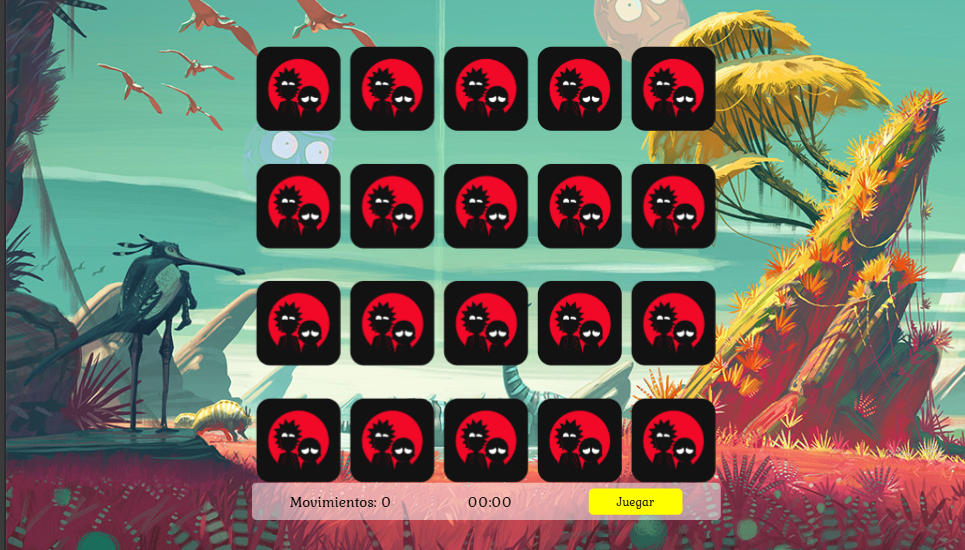

# Rick and Morty Memory Game 🛸

Un juego de memoria interactivo inspirado en la serie _Rick and Morty_, desarrollado con HTML, CSS y JavaScript. Usa personajes reales de la API oficial para crear un desafío visual donde debes emparejar cartas en el menor tiempo y con la menor cantidad de movimientos posible.

## 🚀 Características

- 🎮 Dinámica clásica de emparejar cartas.
- 👾 Personajes aleatorios extraídos desde [Rick and Morty API](https://rickandmortyapi.com/).
- ⏱️ Cronómetro en tiempo real y contador de movimientos.
- 🧠 Mejora tu memoria y agilidad visual.
- 🎉 Animaciones y efectos visuales llamativos.
- 💡 Totalmente responsive y adaptable a dispositivos móviles.

## 🛠️ Tecnologías usadas

- HTML5
- CSS3
- JavaScript (Puro)
- [Rick and Morty API](https://rickandmortyapi.com/)
- SweetAlert (para notificaciones)

## 📂 Estructura del proyecto

```bash
├── index.html
├── src
│   ├── css
│   │   ├── styles.css
│   │   └── game.css
│   └── js
│       └── game.js
├── assets
│   ├── icono.png
│   └── logo.png
├── video
│   └── video.mp4
└── README.md
```

## 📸 Vista previa



## ✅ Cómo usar

1. Clona el repositorio:

```bash
git clone https://github.com/tuusuario/rick-and-morty-memory-game.git
```

2. Abre el archivo `index.html` en tu navegador o súbelo a un servidor como [Vercel](https://vercel.com/).

## 📦 Deploy

El proyecto está listo para ser desplegado fácilmente en plataformas como:

- [Vercel](https://vercel.com/)
- GitHub Pages
- Netlify
